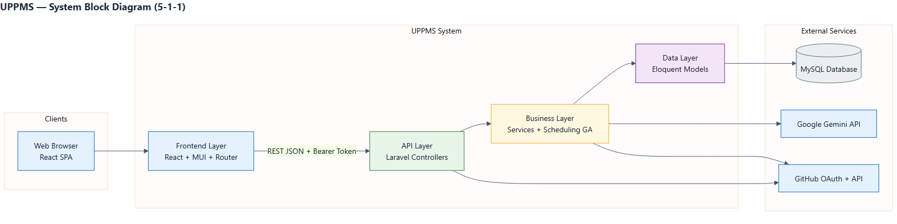
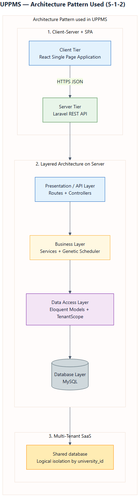
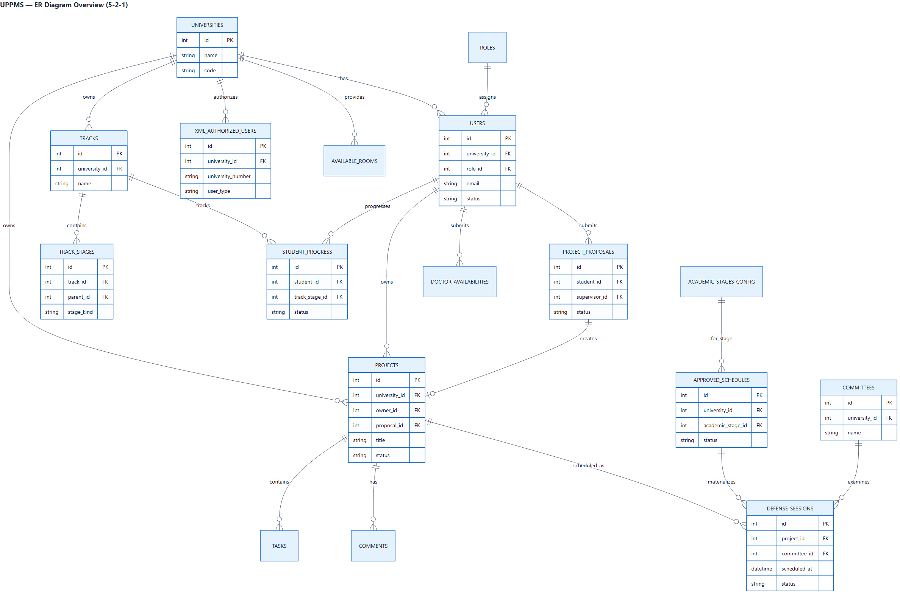

# الفصل الخامس: التصميم عالي المستوى
## UPPMS — University Project Portfolio Management System

> وفق دليل كتابة أطروحة مشروع التخرج — كلية هندسة الذكاء الاصطناعي — الجامعة السورية الخاصة (SPU)

---

## 5-1 التصميم عالي المستوى

يهدف هذا القسم إلى توضيح كيفية تنفيذ النظام بناءً على التحليل السابق، من خلال مخطط المكوّنات، نمط المعمارية، والشرح النصي للتصميم.

### 5-1-1 System Block Diagram

يوضح المخطط التالي المكوّنات الرئيسية لنظام UPPMS وتفاعلها:



**مكوّنات المخطط:**

| المكوّن | الوصف |
|---------|--------|
| Web Browser (React SPA) | واجهة المستخدم في المتصفح |
| Frontend Layer | صفحات ومكوّنات React مع MUI وإدارة الحالة |
| API Layer | Laravel Controllers تستقبل طلبات REST |
| Business Layer | Services + محرك الجدولة الجينية |
| Data Layer | Eloquent Models مع عزل الجامعات |
| MySQL | قاعدة البيانات الرئيسية |
| Google Gemini API | اقتراح أفكار المشاريع وتوليد المهام |
| GitHub OAuth + API | ربط الحساب ومزامنة المستودع والإصدارات |

ملف المصدر: `diagrams/01-system-block-diagram.mmd`

---

### 5-1-2 Architecture Pattern

يعتمد نظام UPPMS على نمط معماري مركّب يناسب تطبيقات الويب الحديثة:

1. **SPA + REST API**  
   الواجهة الأمامية تطبيق React منفصل، والخلفية واجهة برمجية Laravel REST تحت المسار `/api`.

2. **Layered Architecture على الخادم**  
   الطبقات: `Routes → Controllers → Services → Models → Database`  
   منطق الأعمال موجود في طبقة Services وليس داخل الـ Controllers.

3. **MVC داخل Laravel**  
   Models تمثّل البيانات، Controllers تنسّق الطلب/الرد، وViews غير مستخدمة للواجهة لأن الواجهة React.

4. **Multi-Tenant SaaS (Database shared + Tenant Scope)**  
   عدة جامعات على نفس قاعدة البيانات مع عزل منطقي عبر `university_id` و`TenantScope`.



**لماذا هذا النمط؟**
- فصل الواجهة عن المنطق يسهّل التطوير والصيانة.
- طبقة Services تسمح بإعادة استخدام القواعد (مقترحات، مسارات، جدولة).
- REST + Bearer Token مناسب لتطبيق React أحادي الصفحة.
- عزل الجامعات ضروري لأن النظام SaaS متعدد المستأجرين.

---

### 5-1-3 System Architecture Design (شرح نصي للمخطط)

هذا القسم يشرح **مخطط الكتل في 5-1-1** عنصراً بعنصر، وليس وصفاً عاماً للنظام بمعزل عن الشكل.

**جهة Clients:**  
مكوّن Web Browser (React SPA) هو مدخل المستخدم؛ الواجهة تعمل في المتصفح والسهم إلى Frontend Layer يوضح ذلك.

**صندوق UPPMS System:**
1. **Frontend Layer (React + MUI + Router):** تبني الواجهة وترسل الطلبات. السهم إلى API مكتوب عليه REST JSON + Bearer Token.
2. **API Layer (Laravel Controllers):** نقطة دخول `/api`؛ Controllers رفيعة تمرّر العمل إلى Services.
3. **Business Layer (Services + Scheduling GA):** منطق الأعمال والجدولة الجينية؛ ومنها أسهم إلى Gemini وGitHub.
4. **Data Layer (Eloquent Models):** النماذج وعزل الجامعة؛ ومنها سهم إلى MySQL.

**جهة External Services:**  
MySQL للتخزين، Gemini للذكاء الاصطناعي، GitHub للتفويض ومزامنة المستودع (مع ارتباط أيضاً من API Layer لمسار OAuth).

**قراءة الأسهم:** Browser→Frontend→API→Business→Data→MySQL، مع تكامل Business نحو Gemini/GitHub عند الحاجة.

---

## 5-2 تصميم قاعدة البيانات

### 5-2-1 ER Diagram



يوضح المخطط الكيانات الأساسية وعلاقاتها (نظرة عامة مركّزة على جوهر النظام). التفاصيل الكاملة للجداول في الملف:

`schemas/relational-schema.md`

**أهم العلاقات:**
- الجامعة تضم المستخدمين والمشاريع والمسارات والجداول واللجان.
- المقترح المعتمد ينشئ مشروعاً (`project_proposals` → `projects`).
- المسار يحتوي مراحل هرمية؛ تقدّم الطالب يرتبط بمرحلة المسار.
- الجدول المعتمد يُنشئ جلسات مناقشة؛ الجلسة قد ترتبط بلجنة.
- XML يحدد المستخدمين المصرّح لهم قبل/عند التسجيل.

---

### 5-2-2 Relational Schema

انظر: [`schemas/relational-schema.md`](schemas/relational-schema.md)

ملخص الجداول الرئيسية:

| الجدول | الغرض |
|--------|--------|
| `universities` | المستأجر (الجامعة) |
| `roles` / `users` | الأدوار والمستخدمون |
| `projects` / `tasks` / `comments` | المشاريع والتعاون |
| `project_proposals` | مقترحات المشاريع |
| `tracks` / `track_stages` / `student_progress` | المسارات والتقدّم |
| `academic_stages_config` / `available_rooms` / `doctor_availabilities` | إعداد الجدولة |
| `approved_schedules` / `defense_sessions` | الجداول والجلسات |
| `committees` / `committee_members` / `committee_assignments` | اللجان |
| `xml_authorized_users` / `xml_import_logs` | استيراد XML |
| `notifications` | الإشعارات |
| `personal_access_tokens` | رموز Sanctum |

---

### 5-2-3 Constraints and Keys

انظر: [`schemas/constraints-and-keys.md`](schemas/constraints-and-keys.md)

أبرز القيود:
- مفاتيح أساسية لكل الجداول.
- مفاتيح أجنبية لربط الجامعة، المستخدم، المشروع، المسار، الجلسة، اللجنة.
- قيود فريدة مثل `(university_id, student_number)` و`(university_id, name)` للمسارات/اللجان.
- قيم حالة محدودة (enums/strings): `pending/active/rejected/graduated` للمستخدم، وحالات المقترح والمهمة والتقدّم والجلسة.
- عزل المستأجر عبر `university_id` + Global Scope برمجياً.

---

## 5-3 تصميم الواجهات البرمجية الخارجية (External APIs)

النظام يستهلك واجهات خارجية، ويعرّض أيضاً REST API داخلياً للواجهة الأمامية.

### 5-3-1 External APIs التي يستخدمها النظام

#### أ) Google Gemini API

| البند | التفاصيل |
|--------|----------|
| الاستخدام | اقتراح أفكار مشاريع + توليد مهام المشروع |
| Endpoint | `POST https://generativelanguage.googleapis.com/v1beta/models/{model}:generateContent` |
| المصادقة | Header: `x-goog-api-key` (`GEMINI_API_KEY`) |
| النموذج الافتراضي | `gemini-2.5-flash` |
| الخدمات الداخلية | `AIIdeationService`, `AITaskService` |
| مسارات UPPMS | `POST /api/ai/suggest-projects` — `POST /api/projects/{project}/generate-tasks` |
| الرد المتوقع | JSON منظم (أفكار / مهام) |
| أخطاء شائعة | مفتاح غير صالح، حد معدل الطلبات، JSON غير صالح |

#### ب) GitHub OAuth + GitHub REST API

| البند | التفاصيل |
|--------|----------|
| الاستخدام | ربط حساب المستخدم، مزامنة الـ commits، دفع الإصدارات |
| OAuth | Socialite — `GET /api/auth/github/redirect`, `GET /api/auth/github/callback` |
| الصلاحيات | scope: `repo` |
| API | `api.github.com` عبر `GithubService` و/أو `users.github_token` |
| أخطاء شائعة | رفض التفويض، توكن منتهٍ، مستودع غير موجود |

### 5-3-2 Internal REST API (ملخص للمجموعات)

التفاصيل التشغيلية للمسارات موثّقة في الكود (`backend last/routes/api.php`). المجموعات الرئيسية:

| المجموعة | أمثلة المسارات | Method |
|----------|----------------|--------|
| Auth | `/register`, `/login`, `/logout` | POST |
| Profile | `/profile`, `/user` | GET/PUT |
| Users | `/users`, approve/reject | GET/POST |
| Projects | `/projects`, `/project/{id}` | GET/POST/PUT/DELETE |
| Proposals | `/proposals` | GET/POST |
| Tasks | `/task/create`, `/project/{id}/tasks` | POST/GET/PUT |
| Tracks | `/tracks`, student-progress | GET/POST/PUT |
| Schedules | `/schedules/generate`, `/schedules/approve` | POST/GET |
| Committees | `/committees`, assign-committee | GET/POST/PUT |
| XML Import | `/admin/xml-import/*` | POST/GET |
| AI | `/ai/suggest-projects`, generate-tasks | POST |
| Platform | `/admin/universities`, `/admin/users` | GET/POST |

**صيغة الرد العامة:** JSON.  
**المصادقة:** Bearer Token (Sanctum).  
**أكواد شائعة:** `200/201` نجاح، `401` غير مصادق، `403` ممنوع/حساب غير نشط، `404` غير موجود، `422` تحقق فاشل، `429` حد معدل.

ملف تفصيلي إضافي: [`schemas/external-and-internal-apis.md`](schemas/external-and-internal-apis.md)

---

## 5-4 تصميم الأمان والصلاحيات

### 5-4-1 آلية المصادقة

| العنصر | التنفيذ في UPPMS |
|--------|------------------|
| الآلية | Laravel Sanctum — Personal Access Tokens |
| التخزين في العميل | `localStorage` + Header `Authorization: Bearer` |
| تسجيل الخروج | حذف التوكن الحالي |
| ليست JWT | التوكنات تديرها Sanctum في جدول `personal_access_tokens` |

### 5-4-2 الأدوار (Roles)

| الدور | الاسم في النظام | الصلاحية العامة |
|-------|-----------------|------------------|
| Student | `student` | مقترحات، مشاريع، مهام، تقدّم، دعوات |
| Supervisor | `supervisor` | مراجعة مقترحات، إشراف، توافر، مناقشات |
| University Admin | `admin` | مستخدمون، XML، مسارات، جدولة، لجان، غرف |
| Super Admin | `super_admin` | إدارة الجامعات والمنصة عبر الجامعات |

### 5-4-3 مستويات الوصول وMiddleware

| الطبقة | الوظيفة |
|--------|---------|
| `auth:sanctum` | يتطلب توكن صالح |
| `EnsureUserHasUniversity` | المستخدم مرتبط بجامعة (استثناء `super_admin`) |
| `user.status` / `CheckUserStatus` | يسمح فقط بـ `active` أو `graduated` |
| `role:...` / `RoleMiddleware` | تقييد المسارات حسب الدور |
| `TenantScope` | عزل بيانات الجامعة تلقائياً في الاستعلامات |

### 5-4-4 دورة التسجيل والاعتماد

1. مدير الجامعة يستورد XML للمستخدمين المصرّح لهم.
2. عند التسجيل: إن وُجد تطابق XML → الحساب `active`؛ وإلا → `pending`.
3. مدير الجامعة يوافق أو يرفض الحسابات المعلّقة.
4. الحسابات `pending`/`rejected` لا تدخل الـ API المحمي.

### 5-4-5 عزل البيانات (Multi-Tenancy)

- كل سجل تشغيلي تقريباً يحمل `university_id`.
- `BelongsToUniversity` + `TenantScope` يمنع رؤية بيانات جامعة أخرى.
- `super_admin` يتجاوز النطاق لإدارة المنصة.

---

## محتويات المجلد

```
docs/chapter-05-high-level-design/
├── README.md
├── 05-chapter-high-level-design.md          ← هذا الملف (الفصل كاملاً)
├── diagrams/
│   ├── 01-system-block-diagram.png / .mmd
│   ├── 02-architecture-layers.png / .mmd
│   └── 03-erd-overview.png / .mmd
└── schemas/
    ├── relational-schema.md
    ├── constraints-and-keys.md
    └── external-and-internal-apis.md
```

## إعادة توليد المخططات

```bash
python docs/scripts/generate_chapter05_diagrams.py
```
